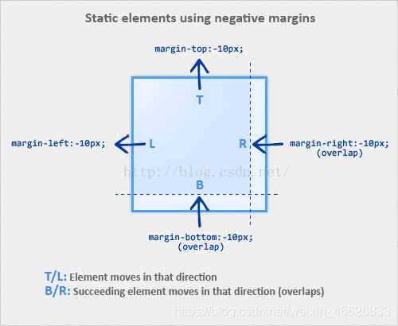

# 第3章 盒模型

## 普通文档流

网页元素的默认布局行为。行内元素跟随文字的方向从左到右排列，当到达容器边缘时会换行。块级元素会占据完整的一行，前后都有换行。

## 盒模型

元素被渲染成盒子，一个盒子由4部分组成：content、padding、border、margin

- content-box：`width/height` 只是内容高度，不包含 `padding` 和 `border`
- border-box：`width/height` 包含了 `padding` 和 `border`

## 水平垂直居中

1. flex 布局
2. grid 布局
3. absolute + transform

    ```css
    .father {
        position: relative;
        width: 200px;
        height: 200px;
        border: 1px solid #000;
    }
    .son {
        position: absolute;
        top: 50%;
        left: 50%;
        transform: translate(-50%, -50%);
        width: 50px;
        height: 50px;
        background-color: red;
    }
    ```

    `translate(-50%, -50%)`将会将元素位移自己宽度和高度的-50%

4. absolute + margin 负值，需要知道子元素宽高

    ```css
    .father {
        position: relative;
        width: 200px;
        height: 200px;
        border: 1px solid #000;
    }
    .son {
        position: absolute;
        top: 50%;
        left: 50%;
        margin-left: -25px;
        margin-top: -25px;
        width: 50px;
        height: 50px;
        background-color: red;
    }
    ```

5. absolute + margin:auto

    ```css
    .father {
        position: relative;
        width: 200px;
        height: 200px;
        border: 1px solid #000;
    }
    .son {
        position: absolute;
        top: 0;
        right: 0;
        bottom: 0;
        left: 0;
        margin: auto;
        width: 50px;
        height: 50px;
        background-color: red;
    }
    ```

## 负外边距

用途：元素重叠、拉伸到比容器还宽

- 元素重叠

    

    margin(top/left)：元素相应地向上或向左移动，导致元素与它前面的元素重叠

    margin(bottom/right)：并不会移动元素，而是将它后面的元素拉过来，覆盖在自己上面

- 拉伸到比容器还宽

    块级元素，不设置宽度时，默认宽度是父元素的宽度。如果在 left/right 加上负边距，则元素的两边都会扩展到容器外面

    

    