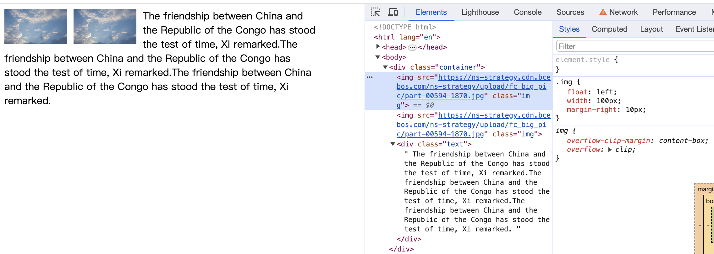
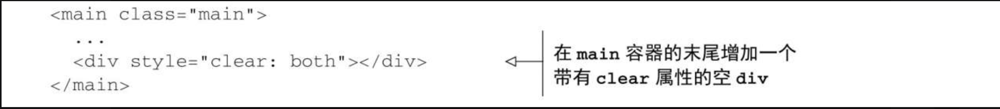
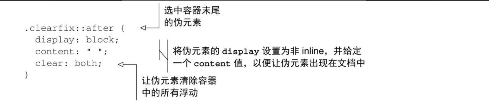

# 理解浮动

## 浮动的设计初衷

实现文字环绕图片效果，用于书刊

父元素（非浮动）无法被浮动子元素正常撑开

## 清除浮动

跟浮动配套的 `clear` 属性，可选值 `none`、`left`、`right`、`both`、`inline-start`、`inline-end`

- 方法一：添加带 `clear` 属性的空元素

    

- 方法二：`clearfix`方案，给**包含浮动元素的父元素**添加一个 `clearfix` `class`，利用`clearfix` 的伪元素 `::after`，实现元素末尾添加一个看不见的 `block` 元素清理浮动

    

    注意：是给包含浮动元素的父元素`clearfix`
